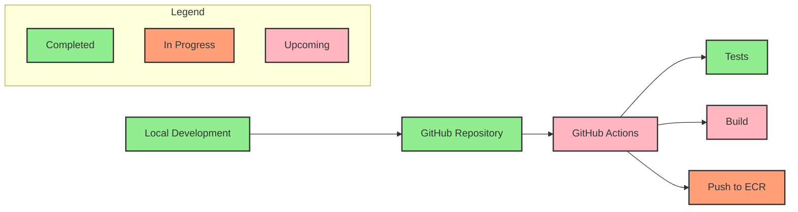

# Article API with CI/CD Pipeline - Complete Guide

## Installation and Running Instructions

### Prerequisites
- Python 3.11
- pip (Python package manager)
- Homebrew (for macOS users)

### Installation Steps

1. Install Python 3.11 (if not already installed):
   ```bash
   brew install python@3.11
   ```

2. Clone the repository and navigate to the project directory:
   ```bash
   git clone <repository-url>
   cd <project-directory>
   ```

3. Create and activate a virtual environment:
   ```bash
   # Remove existing virtual environment if any
   rm -rf venv
   
   # Create new virtual environment with Python 3.11
   /usr/local/bin/python3.11 -m venv venv
   
   # Activate the virtual environment
   source venv/bin/activate
   ```

4. Install the required packages:
   ```bash
   pip install -r requirements.txt
   ```

### Running the Application

1. Make sure you're in the project directory and the virtual environment is activated:
   ```bash
   source venv/bin/activate
   ```

2. Start the FastAPI application:
   ```bash
   uvicorn app.main:app --reload
   ```

3. The application will be available at:
   - Main API: http://127.0.0.1:8000
   - Swagger UI Documentation: http://127.0.0.1:8000/docs
   - ReDoc Documentation: http://127.0.0.1:8000/redoc

### Testing the Application

1. Run the test suite:
   ```bash
   pytest -v
   ```

2. Test the API endpoints using curl:
   ```bash
   # Create a new article
   curl -X POST "http://127.0.0.1:8000/api/v1/articles/" \
        -H "Content-Type: application/json" \
        -d '{"title": "Test Article", "content": "Test content", "author": "Test Author"}'

   # Get all articles
   curl "http://127.0.0.1:8000/api/v1/articles/"

   # Get a specific article (replace {id} with actual article ID)
   curl "http://127.0.0.1:8000/api/v1/articles/{id}"

   # Update an article (replace {id} with actual article ID)
   curl -X PUT "http://127.0.0.1:8000/api/v1/articles/{id}" \
        -H "Content-Type: application/json" \
        -d '{"title": "Updated Title", "content": "Updated content"}'

   # Delete an article (replace {id} with actual article ID)
   curl -X DELETE "http://127.0.0.1:8000/api/v1/articles/{id}"
   ```

## What You'll Learn (and Why It Matters)
This project teaches you how to build a modern web application with a complete CI/CD pipeline. Here's why each component is important:

1. **FastAPI Application**
   - FastAPI is a modern, fast web framework for building APIs
   - It automatically generates documentation (like a user manual for your API)
   - It's built on Python, which is easy to learn and widely used
   - It's perfect for building RESTful APIs (APIs that follow standard web conventions)

2. **Docker Containerization**
   - Docker packages your application with all its dependencies
   - It ensures your app runs the same way everywhere (your laptop, cloud, etc.)
   - It's like shipping your application in a standardized box that works anywhere

3. **Automated Testing**
   - Tests verify your code works correctly
   - They catch bugs before they reach production
   - They make it safe to change code without breaking things

4. **Cloud Infrastructure**
   - Cloud platforms (like AWS) provide reliable, scalable hosting
   - They handle hardware maintenance and security
   - They allow your application to grow as needed

5. **CI/CD Pipeline**
   - CI (Continuous Integration) means frequently merging code changes
   - CD (Continuous Deployment) means automatically deploying changes
   - Together, they make development faster and more reliable

## Week 1: FastAPI Basics and Docker

### Project Setup - Step by Step

1. **Create Project Directory**
```bash
mkdir article-api
cd article-api
```
Why? This creates a dedicated folder for your project, keeping everything organized.

2. **Create Virtual Environment**
```bash
python -m venv venv
source venv/bin/activate  # On Windows: venv\Scripts\activate
```
Why? A virtual environment is like a clean room for your project:
- It keeps project dependencies separate from other Python projects
- It prevents version conflicts between different projects
- It makes it easier to share your project with others

3. **Install Required Packages**
```bash
pip install fastapi==0.104.1 uvicorn==0.24.0 pydantic==2.4.2 pytest==7.4.3 httpx==0.25.1 python-dotenv==1.0.0
```
Why each package?
- `fastapi`: The main web framework
- `uvicorn`: The server that runs your FastAPI application
- `pydantic`: For data validation and settings management
- `pytest`: For writing and running tests
- `httpx`: For making HTTP requests in tests
- `python-dotenv`: For managing environment variables

### Running the Application

1. **Start Development Server**
```bash
uvicorn app.main:app --reload
```
Why `--reload`?
- It automatically reloads the server when you make code changes
- Makes development faster as you don't need to restart manually

2. **Access API Documentation**
- Swagger UI: http://localhost:8000/docs
- ReDoc: http://localhost:8000/redoc
Why two documentation formats?
- Swagger UI is interactive - you can try out the API directly
- ReDoc is more readable and better for sharing

### Testing the API

1. **Run Automated Tests**
```bash
pytest
```
Why tests?
- They verify your API works correctly
- They catch bugs before they reach users
- They make it safe to change code

2. **Test API Manually**
```bash
# Create an article
curl -X POST "http://localhost:8000/api/v1/articles/" \
     -H "Content-Type: application/json" \
     -d '{"title":"My First Article","content":"This is the content","author":"John Doe"}'
```
Why curl?
- It's a command-line tool for making HTTP requests
- It's useful for testing APIs without a browser
- It's available on most operating systems

### Docker Setup

1. **Build Docker Image**
```bash
docker build -t article-api .
```
Why Docker?
- It packages your application with all its dependencies
- It ensures consistent behavior across different environments
- It makes deployment easier

2. **Run Docker Container**
```bash
docker run -p 8000:8000 article-api
```
Why port mapping?
- `-p 8000:8000` maps port 8000 in the container to port 8000 on your machine
- This allows you to access the application from your browser

## Project Structure Explained

```
.
├── app/                    # Main application code
│   ├── api/               # API endpoints (URL handlers)
│   │   ├── articles.py    # Article-related endpoints
│   │   └── __init__.py    # Makes the directory a Python package
│   ├── models/            # Data models (data structures)
│   │   ├── article.py     # Article data structure
│   │   └── __init__.py    # Makes the directory a Python package
│   └── main.py            # Application entry point
├── tests/                 # Test files
│   └── test_articles.py   # Article API tests
├── Dockerfile            # Container configuration
└── requirements.txt      # Python dependencies
```

## Key Components Explained

1. **FastAPI Application (`app/main.py`)**
   - Sets up the web server
   - Configures CORS (Cross-Origin Resource Sharing) to allow requests from different domains
   - Defines the main API routes
   - Why CORS? It's a security feature that controls which websites can access your API

2. **Article Model (`app/models/article.py`)**
   - Defines the data structure for articles
   - Includes validation rules (e.g., title length limits)
   - Handles timestamps and UUIDs
   - Why UUIDs? They provide unique identifiers that work across different systems

3. **API Endpoints (`app/api/articles.py`)**
   - Implements CRUD operations (Create, Read, Update, Delete)
   - Handles HTTP requests and responses
   - Manages in-memory storage (will be replaced with database)
   - Why in-memory storage? It's simple for initial development, but not suitable for production

4. **Tests (`tests/test_articles.py`)**
   - Verifies API functionality
   - Tests all CRUD operations
   - Ensures data validation works
   - Why test each operation? To ensure the API behaves correctly in all scenarios

5. **Docker Configuration (`Dockerfile`)**
   - Creates a production-ready container
   - Sets up the Python environment
   - Configures the application to run in a container
   - Why production-ready? It ensures the container is optimized for real-world use

## System Architecture Explained

### 1. CI/CD Pipeline Flow
```
┌─────────────────────────────────────────────────────────────────────────┐
│                                                                         │
│  Developer Workflow                                                     │
│  ┌─────────────┐    ┌─────────────┐    ┌─────────────┐    ┌──────────┐ │
│  │  Local Dev  │───▶│  GitHub     │───▶│  GitHub     │───▶│  ECR     │ │
│  │  FastAPI    │    │  Repository │    │  Actions    │    │  Registry│ │
│  └─────────────┘    └─────────────┘    └─────────────┘    └──────────┘ │
│                                                                         │
│  Production Environment                                                 │
│  ┌─────────────┐    ┌─────────────┐    ┌─────────────┐    ┌──────────┐ │
│  │  Terraform  │───▶│  EKS        │───▶│  ArgoCD     │───▶│  FastAPI │ │
│  │  IAC        │    │  Cluster    │    │  GitOps     │    │  App     │ │
│  └─────────────┘    └─────────────┘    └─────────────┘    └──────────┘ │
│                                                                         │
└─────────────────────────────────────────────────────────────────────────┘
```

Why this flow?
1. **Local Development**
   - You write and test code on your computer
   - FastAPI makes development fast and easy

2. **GitHub Repository**
   - Stores your code securely
   - Tracks changes over time
   - Enables collaboration

3. **GitHub Actions**
   - Automatically runs tests
   - Builds Docker images
   - Ensures code quality

4. **ECR (Elastic Container Registry)**
   - Stores Docker images securely
   - Makes images available for deployment
   - Manages image versions

5. **Terraform**
   - Defines cloud infrastructure as code
   - Makes infrastructure reproducible
   - Manages cloud resources

6. **EKS (Elastic Kubernetes Service)**
   - Runs containers in the cloud
   - Handles scaling and load balancing
   - Manages container orchestration

7. **ArgoCD**
   - Automates deployments
   - Ensures desired state
   - Provides deployment visibility

### 2. Application Architecture
```
┌─────────────────────────────────────────────────────────────────────────┐
│                                                                         │
│  Client Layer                                                           │
│  ┌─────────────┐    ┌─────────────┐    ┌─────────────┐                 │
│  │  Web        │    │  Mobile     │    │  CLI        │                 │
│  │  Browser    │    │  App        │    │  Tools      │                 │
│  └─────────────┘    └─────────────┘    └─────────────┘                 │
│                                                                         │
│  API Layer                                                              │
│  ┌───────────────────────────────────────────────────────────────────┐ │
│  │  FastAPI Application                                             │ │
│  │  ┌─────────────┐    ┌─────────────┐    ┌─────────────┐          │ │
│  │  │  Routes     │───▶│  Models     │───▶│  Services   │          │ │
│  │  └─────────────┘    └─────────────┘    └─────────────┘          │ │
│  └───────────────────────────────────────────────────────────────────┘ │
│                                                                         │
│  Data Layer                                                             │
│  ┌─────────────┐    ┌─────────────┐    ┌─────────────┐                 │
│  │  PostgreSQL │    │  Redis      │    │  ECR        │                 │
│  │  Database   │    │  Cache      │    │  Registry   │                 │
│  └─────────────┘    └─────────────┘    └─────────────┘                 │
│                                                                         │
└─────────────────────────────────────────────────────────────────────────┘
```

Why this architecture?
1. **Client Layer**
   - Different ways users can access your API
   - Each client type has specific needs
   - Supports multiple user interfaces

2. **API Layer**
   - Routes: Handle incoming requests
   - Models: Define data structures
   - Services: Implement business logic

3. **Data Layer**
   - PostgreSQL: Main database for persistent storage
   - Redis: Fast cache for frequently accessed data
   - ECR: Stores Docker images

### 3. Infrastructure Architecture
```
┌─────────────────────────────────────────────────────────────────────────┐
│                                                                         │
│  AWS Infrastructure                                                     │
│  ┌─────────────┐    ┌─────────────┐    ┌─────────────┐                 │
│  │  EKS        │    │  ECR        │    │  RDS        │                 │
│  │  Cluster    │    │  Registry   │    │  PostgreSQL │                 │
│  └─────────────┘    └─────────────┘    └─────────────┘                 │
│                                                                         │
│  Kubernetes Components                                                  │
│  ┌───────────────────────────────────────────────────────────────────┐ │
│  │  ArgoCD                                                          │ │
│  │  ┌─────────────┐    ┌─────────────┐    ┌─────────────┐          │ │
│  │  │  App        │───▶│  Deployment │───▶│  Service    │          │ │
│  │  │  Controller │    │  Controller │    │  Controller │          │ │
│  │  └─────────────┘    └─────────────┘    └─────────────┘          │ │
│  └───────────────────────────────────────────────────────────────────┘ │
│                                                                         │
│  Monitoring & Logging                                                   │
│  ┌─────────────┐    ┌─────────────┐    ┌─────────────┐                 │
│  │  Prometheus │    │  Grafana    │    │  ELK Stack  │                 │
│  │  Metrics    │    │  Dashboard  │    │  Logging    │                 │
│  └─────────────┘    └─────────────┘    └─────────────┘                 │
│                                                                         │
└─────────────────────────────────────────────────────────────────────────┘
```

Why this infrastructure?
1. **AWS Infrastructure**
   - EKS: Managed Kubernetes service
   - ECR: Container registry
   - RDS: Managed database service

2. **Kubernetes Components**
   - ArgoCD: GitOps tool for deployments
   - Controllers: Manage different aspects of the application
   - Services: Handle networking and load balancing

3. **Monitoring & Logging**
   - Prometheus: Collects metrics
   - Grafana: Visualizes metrics
   - ELK Stack: Manages logs

## Troubleshooting Guide

1. **Port Already in Use**
```bash
# Find the process using port 8000
lsof -i :8000
# Kill the process
kill -9 <PID>
```
Why this happens?
- Another application might be using the port
- A previous instance of your app might not have shut down properly

2. **Docker Build Issues**
```bash
# Clean up Docker cache
docker system prune
# Rebuild the image
docker build --no-cache -t article-api .
```
Why clean the cache?
- Ensures a fresh build
- Fixes issues with outdated layers
- Resolves dependency conflicts

3. **Test Failures**
```bash
# Run tests with verbose output
pytest -v
# Run specific test file
pytest tests/test_articles.py
```
Why verbose output?
- Shows more details about test failures
- Helps identify the exact point of failure
- Makes debugging easier 

## Next Week: Database Integration (Week 2)

### Topics We'll Cover

1. **PostgreSQL Fundamentals**
   - What is PostgreSQL and why use it?
   - Setting up PostgreSQL locally
   - Basic database concepts
   - SQL basics for web applications

2. **SQLAlchemy ORM**
   - Understanding Object-Relational Mapping
   - Setting up SQLAlchemy with FastAPI
   - Creating database models
   - Writing database queries

3. **Database Migrations**
   - What are migrations and why we need them
   - Setting up Alembic
   - Creating and managing migrations
   - Best practices for database changes

4. **Updating Our API**
   - Converting from in-memory to database storage
   - Implementing proper CRUD operations
   - Adding error handling
   - Optimizing database queries

5. **Testing with Database**
   - Setting up test database
   - Writing database tests
   - Using test fixtures
   - Testing database transactions

### Preparation Checklist

1. **Required Software**
```bash
# Install PostgreSQL (macOS)
brew install postgresql@14
brew services start postgresql@14

# Install Python packages
pip install sqlalchemy==2.0.23 alembic==1.12.1 psycopg2-binary==2.9.9
```

2. **What to Review**
   - Basic SQL concepts
   - Python classes and inheritance
   - Current FastAPI implementation
   - CRUD operations in our API

### Hands-on Exercises

1. **Database Setup**
   - Create database and user
   - Configure connection settings
   - Test database connection

2. **Model Implementation**
   - Create SQLAlchemy models
   - Add relationships
   - Implement validations

3. **Migration Practice**
   - Initialize Alembic
   - Create initial migration
   - Apply and rollback changes

4. **API Updates**
   - Update endpoints for database
   - Add error handling
   - Implement transactions

5. **Testing**
   - Set up test database
   - Write integration tests
   - Test database operations

### Learning Objectives

By the end of next week, you'll be able to:
1. Set up and configure PostgreSQL
2. Use SQLAlchemy for database operations
3. Manage database changes with migrations
4. Implement database-backed APIs
5. Write effective database tests

### Questions to Consider

1. How does database storage improve our application?
2. What are the benefits of using an ORM?
3. Why are migrations important?
4. How do we handle database errors?
5. What's the best way to test database operations?

### Resources for Preparation

1. **PostgreSQL Documentation**
   - [Official PostgreSQL Docs](https://www.postgresql.org/docs/)
   - Basic SQL commands
   - Database administration

2. **SQLAlchemy Documentation**
   - [SQLAlchemy ORM Tutorial](https://docs.sqlalchemy.org/en/20/orm/tutorial.html)
   - Model definitions
   - Query building

3. **Alembic Documentation**
   - [Alembic Tutorial](https://alembic.sqlalchemy.org/en/latest/tutorial.html)
   - Migration commands
   - Version control

4. **FastAPI with Databases**
   - [FastAPI SQL Databases](https://fastapi.tiangolo.com/tutorial/sql-databases/)
   - Database integration
   - CRUD operations 

## Week 1's Role in CI/CD Pipeline

Week 1's FastAPI and Docker setup forms the foundation of our CI/CD pipeline. The FastAPI application serves as our core service that will be containerized and deployed, while Docker ensures consistent environments across development, testing, and production. This week's components are crucial for CI/CD as they establish the application's basic structure, testing framework, and containerization strategy. The automated tests we've implemented will be the first line of defense in our CI pipeline, running automatically on every code push. Docker containerization enables seamless deployment across different environments, which is essential for CD. The project structure and configuration we've set up this week will be the template for all future deployments, making it a critical first step in building a robust CI/CD pipeline. 

## CI Workflow Progress



### Current Progress (Week 1)

1. ✅ **Local Development**
   - FastAPI application setup
   - Automated testing with pytest
   - Docker containerization

2. ✅ **GitHub Repository**
   - Project structure
   - Code organization
   - Version control

3. ✅ **Local Tests**
   - Unit tests for API endpoints
   - Integration tests
   - Test automation

4. 🚧 **Build** (Upcoming)
   - Docker image creation
   - Container configuration
   - Environment setup
   - Build test automation

5. 🚧 **Push to ECR** (In Progress)
   - Container registry setup
   - Image versioning
   - Deployment preparation

### Next Steps in CI Pipeline

1. **GitHub Actions Setup** (Week 2)
   - Configure workflow files
   - Set up automated testing
   - Implement build process
   - Add build test automation

2. **ECR Integration** (Week 2)
   - Create ECR repository
   - Configure access
   - Set up image pushing

3. **Security Scanning** (Week 3)
   - Implement vulnerability checks
   - Set up dependency scanning
   - Configure security policies

4. **Quality Gates** (Week 3)
   - Code coverage requirements
   - Performance benchmarks
   - Code quality checks 